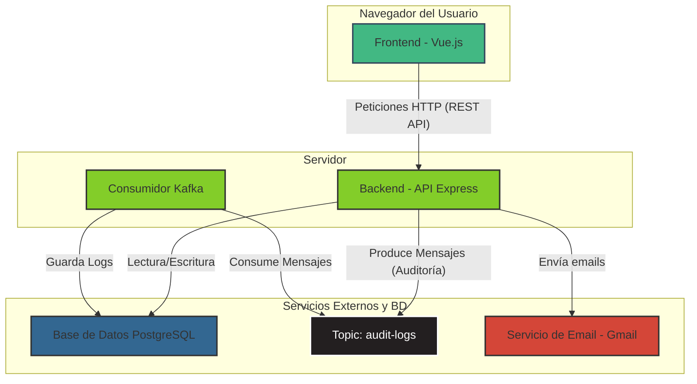

# Arquitectura del Sistema - EuroPol

Este documento describe la arquitectura de alto nivel de la aplicación EuroPol, sus componentes principales y cómo interactúan entre sí.

## 1. Vista General

EuroPol es una aplicación web Full-Stack con una arquitectura de servicios desacoplada. Está compuesta por un frontend (Single Page Application), un backend (API RESTful), una base de datos relacional y un sistema de mensajería para tareas asíncronas como la auditoría.

## 2. Componentes Principales

### a. Frontend (Cliente)
*   **Tecnología:** Vue.js (Vue 3) con Composition API.
*   **Descripción:** Es una Single Page Application (SPA) que se ejecuta en el navegador del usuario. Es responsable de toda la interfaz de usuario y la experiencia del cliente. No contiene lógica de negocio crítica.
*   **Comunicación:** Se comunica exclusivamente con el Backend a través de su API REST.
*   **Librerías Clave:** `axios` para peticiones HTTP, `vue-router` para la navegación.

### b. Backend (Servidor API)
*   **Tecnología:** Node.js con Express.js.
*   **Descripción:** Es el cerebro de la aplicación. Expone una API RESTful que el frontend consume. Maneja la lógica de negocio, la autenticación de usuarios, la validación de datos y la interacción con la base de datos y otros servicios.
*   **Responsabilidades:**
    *   Servir los endpoints de la API (ej: `/api/users`, `/api/productos`).
    *   Autenticación y autorización mediante JWT.
    *   Interactuar con la base de datos PostgreSQL.
    *   Producir mensajes de auditoría y enviarlos a Kafka.
    *   Enviar correos electrónicos a través de un servicio externo (Gmail).

### c. Base de Datos
*   **Tecnología:** PostgreSQL.
*   **Descripción:** Es el sistema de almacenamiento persistente para todos los datos de la aplicación, como usuarios, roles, empresas, productos, dibujos, materiales y los logs de auditoría.

### d. Broker de Mensajes (Auditoría)
*   **Tecnología:** Apache Kafka.
*   **Descripción:** Se utiliza para desacoplar el sistema de auditoría del flujo principal de la API. Cuando ocurre una acción crítica (ej: crear un producto), el Backend envía un mensaje al topic `audit-logs` y responde inmediatamente al usuario, sin esperar a que el log se escriba en la base de datos.

### e. Consumidor de Kafka
*   **Tecnología:** Node.js (proceso separado).
*   **Descripción:** Es un servicio que se ejecuta de forma independiente. Su única responsabilidad es escuchar los mensajes del topic `audit-logs` de Kafka y guardarlos en la tabla `audit_logs` de la base de datos PostgreSQL.

## 3. Diagrama de Arquitectura

El siguiente diagrama ilustra el flujo de comunicación entre los componentes:



## 4. Gestión de Diagramas

Siguiendo las mejores prácticas de "documentación como código", los diagramas de arquitectura y de flujo se gestionan de la siguiente manera:

*   **Formato de Texto (Mermaid):** Se utiliza **Mermaid** para crear diagramas directamente en los archivos Markdown. Esto permite que los diagramas sean texto plano, fáciles de editar y de revisar en los `diffs` de Git.
*   **Almacenamiento:** Los diagramas se almacenan como bloques de código `mermaid` dentro de los archivos `.md` en la carpeta `/docs`. No se deben subir archivos de imagen binarios (como `.png` o `.jpg`) para los diagramas de arquitectura, ya que dificultan el control de versiones.
```

## 4. Gestión de Diagramas

Siguiendo las mejores prácticas de "documentación como código", los diagramas de arquitectura y de flujo se gestionan de la siguiente manera:

*   **Formato de Texto (Mermaid):** Se utiliza **Mermaid** para crear diagramas directamente en los archivos Markdown. Esto permite que los diagramas sean texto plano, fáciles de editar y de revisar en los `diffs` de Git.
*   **Almacenamiento:** Los diagramas se almacenan como bloques de código `mermaid` dentro de los archivos `.md` en la carpeta `/docs`. No se deben subir archivos de imagen binarios (como `.png` o `.jpg`) para los diagramas de arquitectura, ya que dificultan el control de versiones.
```