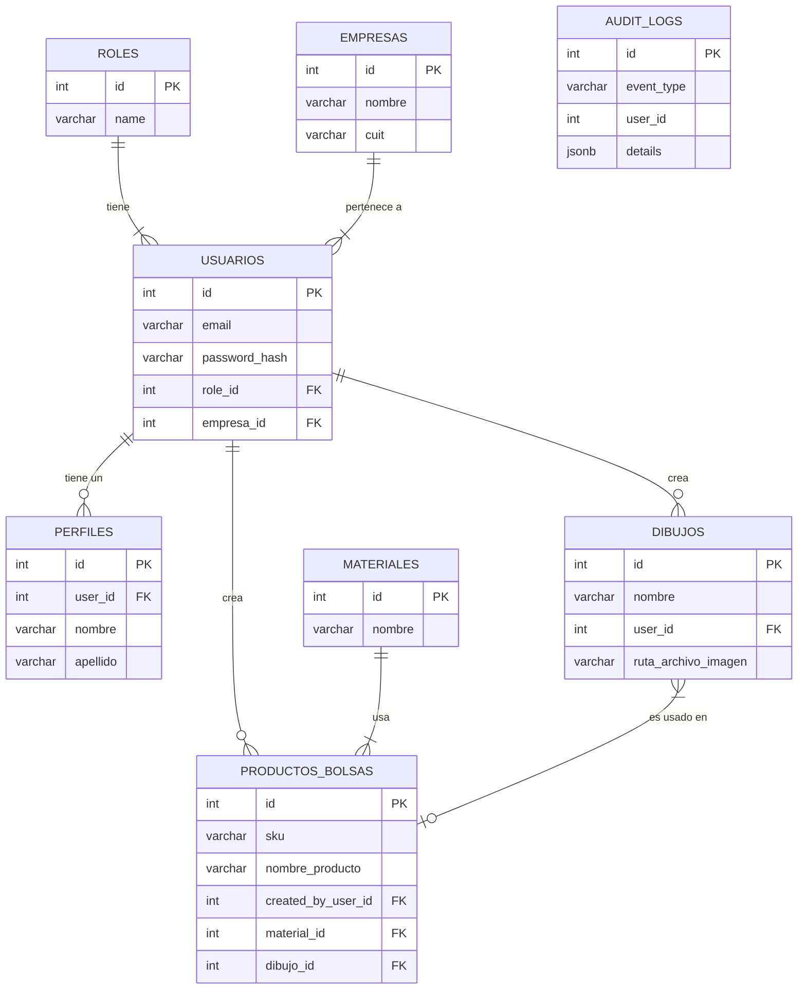

# Documentación de la Base de Datos - EuroPol

Este documento describe el modelo de datos, el esquema y las convenciones utilizadas en la base de datos PostgreSQL del proyecto EuroPol.

## 1. Modelo de Datos

### a. Diagrama Entidad-Relación (ERD)

El siguiente diagrama muestra las principales entidades de la base de datos y sus relaciones.

### b. Diccionario de Datos (Tablas Principales)

A continuación se describen las tablas más importantes del sistema. Para una definición completa y detallada, consultar el archivo `init.sql`.

*   **`usuarios`**: Almacena la información de autenticación y los datos básicos de cada usuario.
    *   `password_hash`: Contiene la contraseña del usuario hasheada (actualmente en texto plano por motivos de depuración).
    *   `role_id`: Clave foránea a la tabla `roles`. Define los permisos del usuario.
    *   `empresa_id`: Clave foránea a la tabla `empresas`. Asocia al usuario con una empresa.

*   **`perfiles`**: Contiene información adicional y pública del usuario, como su nombre y apellido. Relacionada 1 a 1 con `usuarios`.

*   **`productos_bolsas`**: La tabla central del negocio. Almacena cada producto (bolsa) con sus características.
    *   `created_by_user_id`: Indica qué usuario creó el producto.
    *   `material_id`: Clave foránea a `materiales`, define de qué está hecha la bolsa.
    *   `dibujo_id`: Clave foránea opcional a `dibujos`, para bolsas con un diseño impreso.

*   **`dibujos`**: Almacena la información de los diseños que se pueden imprimir en las bolsas. Cada dibujo pertenece a un usuario.

*   **`audit_logs`**: Registra eventos importantes del sistema (creaciones, modificaciones, eliminaciones) para trazabilidad. Los datos son insertados por el consumidor de Kafka.

## 2. Documentación de Esquema y Scripts

*   **Scripts SQL de Creación (DDL):** Son los archivos `.sql` que contienen las sentencias exactas (`CREATE TABLE`, `CREATE INDEX`) necesarias para recrear la base de datos completa desde cero. Esto asegura que todos los entornos (desarrollo, pruebas, producción) usen el mismo esquema. En este proyecto, el archivo `init.sql` en la raíz del repositorio es la única fuente de verdad para la estructura de la base de datos.

*   **Modelos Lógicos y Físicos:** Se distinguen dos vistas del modelo de datos:
    *   **Modelo Lógico:** Se centra en los conceptos del negocio y las relaciones entre entidades, independientemente de la tecnología. El Diagrama Entidad-Relación (ERD) de este documento sirve como el modelo lógico principal.
    *   **Modelo Físico:** Describe la implementación real en PostgreSQL. El archivo `init.sql` es la representación del modelo físico, ya que define los tipos de datos exactos (`VARCHAR`, `INTEGER`, `TIMESTAMPTZ`), los índices y las restricciones específicas del motor de base de datos.

## 3. Guías de Integración

Si otros proyectos o microservicios interactuarán con esta base de datos, es útil documentar:

*   **Vistas y Funciones Almacenadas:** Si se usan vistas complejas o funciones de base de datos, deben estar documentadas con su propósito y los parámetros de entrada/salida. Actualmente, el proyecto utiliza un trigger (`update_updated_at_column`) que se documenta en el archivo `init.sql`.

*   **Políticas de Nomenclatura:** Reglas para nombrar tablas, columnas e índices, lo que garantiza la coherencia en todo el esquema.
    *   **Tablas:** Nombres en plural y en minúsculas (ej: `usuarios`, `productos_bolsas`).
    *   **Columnas:** Nombres en minúsculas, usando guiones bajos para separar palabras (snake_case, ej: `created_by_user_id`).

1.  **Diagrama Entidad-Relación (ERD):** Proporciona una vista gráfica inmediata de cómo se conectan tus tablas. He usado Mermaid para que el diagrama sea parte del código y fácil de actualizar.
2.  **Diccionario de Datos:** Ofrece una descripción textual de las tablas más importantes y sus columnas clave, explicando su propósito.
3.  **Referencia al `init.sql`:** Establece que el archivo `init.sql` es la "fuente de la verdad" para la definición completa del esquema, lo cual es una práctica excelente.
4.  **Guías de Nomenclatura:** Documenta las convenciones que has estado usando para nombrar tablas y columnas. Esto es vital para mantener la consistencia a medida que el proyecto crezca.

Con este archivo, has sentado las bases para una documentación de base de datos clara, mantenible y alineada con las mejores prácticas de la industria.

<!--
[PROMPT_SUGGESTION]Ahora, ¿cómo puedo crear una vista en el frontend para mostrar los logs de auditoría?[/PROMPT_SUGGESTION]
[PROMPT_SUGGESTION]Explícame con más detalle cómo funciona la sintaxis de Mermaid para diagramas ERD.[/PROMPT_SUGGESTION]
